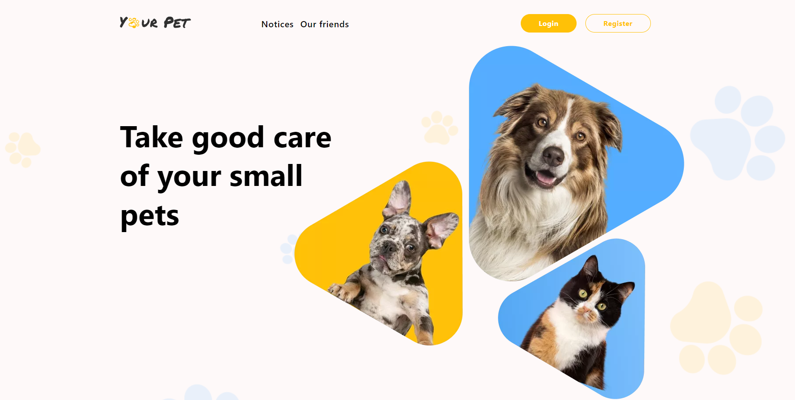

# 🐾 Your Pet 🐾 team project by 'MINUS 1' team

- **[View live page](https://denysborysiuk.github.io/goit-team-project-03/)**
- **[Link to backend code](https://github.com/DenysBorysiuk/your-pet-api/)**
- **[Backend documentation](https://pets-back-end.onrender.com/api-docs/)**

---

## 📝 Project description

### Used technologies:

- React
- Node.js
- MongoDB

### Used libraries:

- Redux
- Axios
- Formik / Yup
- Hot-toast
- Redux-persist

### Features

- The layout is fixed in pixels.
- Semantic and valid markup; accessibility (a11y) is a bonus.
- Responsive and cross-browser layout:
  - Mobile: 360px to 480px (fluid layout, should stretch);
  - Tablet: 768px;
  - Desktop: 1280px.
- Utilize the Mobile-First approach.
- Clean code with preserved formatting. Consider using ESLint/Prettier.
- Code is divided into separate components.
- Error page if the selected route does not exist, styled accordingly
- Backend endpoint documentation is provided using Swagger.

## 📂 Deployment

To deploy this project, you need to perform the following steps:

1. **Clone the repository**: Use the `git clone` command to clone this
   repository to your computer.
2. **Install the dependencies**: Open a terminal in the root of the project and
   run `npm install` or `yarn install` to install all required dependencies.
3. **Setting environment variables**: Create a `.env` file in the root folder
   and add the necessary environment variables that you need for the project
   according to the `.env.example` file.
4. **Run the application**: Run the `npm run dev` or `yarn dev` command to run
   the project on the local server.
5. **Deploy**: To deploy this project to a production server, use hosting
   platforms such as Vercel, Netlify, or others.

